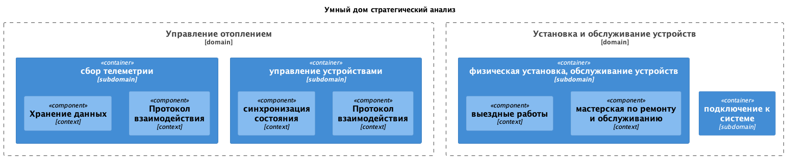
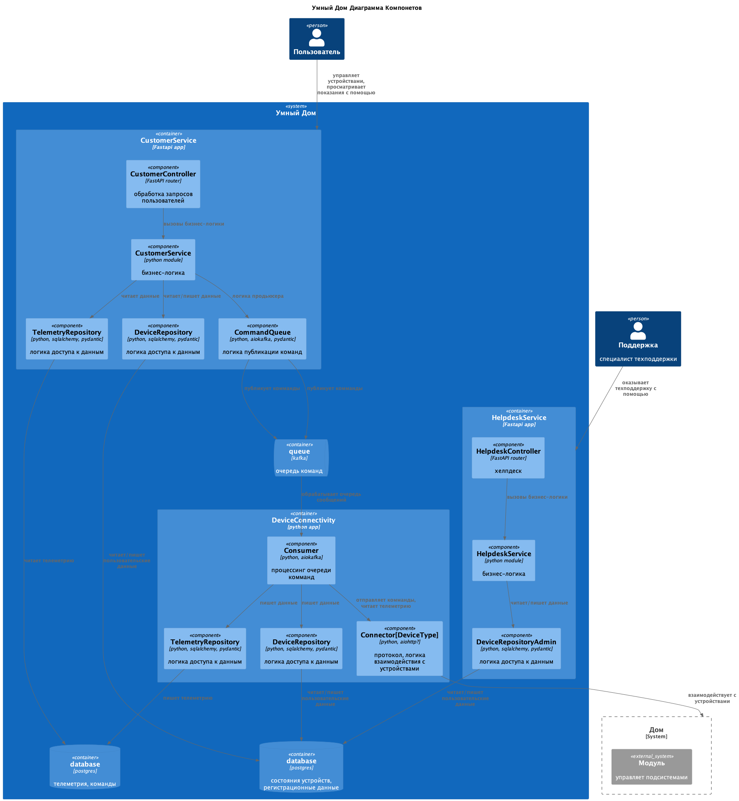
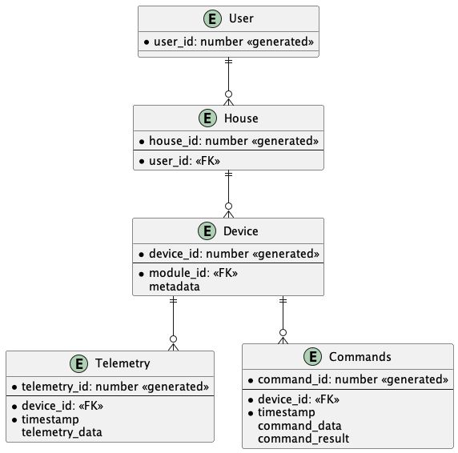

# Проектная работа 3 спринта

## Задание 1: Анализ и проектирование

### Подзадание 1.1: Анализ и планирование

Стратегический анализ текущего состояния:

[diagrams/src/smart-home-monolith/Domain.puml](diagrams/src/smart-home-monolith/Domain.puml)



По результатам анализа требований, описанных в задании была создана C4 контекстная диаграмма:

[diagrams/src/smart-home-monolith/Context.puml](diagrams/src/smart-home-monolith/Context.puml)


Также, для практики, составлены диаграммы контейнеров и компонентов:

[diagrams/src/smart-home-monolith/Containers.puml](diagrams/src/smart-home-monolith/Containers.puml)


[diagrams/src/smart-home-monolith/Components.puml](diagrams/src/smart-home-monolith/Components.puml)


### Подзадание 1.2: Архитектура микросервисов

Основываясь на выделенных доменах и границах контекстов (подзадание 1.1) и бизнес-целях, разбил систему на новые микросервисы, в результате составлены диаграммы контейнеров, компонентов и кода

[diagrams/src/smart-home-microservices/Container.puml](diagrams/src/smart-home-microservices/Container.puml)


[diagrams/src/smart-home-microservices/Components.puml](diagrams/src/smart-home-microservices/Components.puml)



Диаграмму кода решил не делать за недостатком времени.

### Подзадание 1.3: ER-диаграмма

[diagrams/src/smart-home-microservices/ER.puml](diagrams/src/smart-home-microservices/ER.puml)




### Подзадание 1.4: Создание и документирование API

Минималистичное API, обеспечивающее работоспособность CustomerService:
[diagrams/src/openapi.yaml](diagrams/src/openapi.yaml)

```yaml
openapi: '3.0.0'
info:
  title: Умный Дом
  version: '1.0.0'
paths:
  /:
    get:
      summary: получить полную информацию о домах пользователя и привязанных к ним устройствах
      responses:
        '200':
          description: Success
          content:
            application/json:
              schema:
                $ref: '#/components/schemas/User'
  /houses:
    post:
      summary: добавить дом
      requestBody:
        content:
          application/json:
            schema:
              $ref: '#/components/schemas/House'
      responses:
        '200':
          description: Success
          content:
            application/json:
              schema:
                $ref: '#/components/schemas/House'
  /houses/{house_id}:
    patch:
      summary: изменить информацию о доме
      requestBody:
        content:
          application/json:
            schema:
              $ref: '#/components/schemas/House'
      responses:
        '200':
          description: Success
          content:
            application/json:
              schema:
                $ref: '#/components/schemas/House'
        "404":
          description: House not found
        "403":
          description: Forbidden
    post:
      summary: зарегистрировать новое устройство в доме
      requestBody:
        content:
          application/json:
            schema:
              $ref: '#/components/schemas/Device'
      responses:
        '200':
          description: Success
          content:
            application/json:
              schema:
                $ref: '#/components/schemas/House'
        "404":
          description: House not found
        "403":
          description: Forbidden
    put:
      summary: отправить комманду устройству
      description: Success
      requestBody:
        content:
          application/json:
            schema:
              $ref: '#/components/schemas/Command'
      responses:
        '201':
          description: Command added to queue
        '304':
          description: Command is already pending
        "404":
          description: Device not found
        "403":
          description: Forbidden

components:
  schemas:
    Device:
      type: object
      required:
        - metadata
      properties:
        device_id:
          type: integer
          format: int64
        metadata:
          type: object
        pending_commands:
          type: array
          items:
            $ref: '#/components/schemas/Command'
        telemetry:
          $ref: '#/components/schemas/Telemetry'
    Telemetry:
      type: object
      required:
        - timestamp
        - telemetry_data
      properties:
        timestamp:
          type: string
        telemetry_data:
          type: object
    Command:
      required:
        - command_data
      properties:
        command_data:
          type: object
        timestamp:
          type: string
        device_id:
          type: integer
          format: int64
        command_status:
          type: string
    House:
      required:
        - title
      properties:
        house_id:
          type: integer
          format: it64
        title:
          type: string
        devices:
          type: array
          items:
            $ref: '#/components/schemas/Device'
    User:
      properties:
        houses:
          type: array
          items:
            $ref: '#/components/schemas/House'
```

Асинхронное апи для DeviceConnectivity:
[diagrams/src/asyncapi.yaml](diagrams/src/asyncapi.yaml)

```yaml
asyncapi: 3.0.0
info:
  title: Умный дом, управление устройствами
  version: '1.0.0'
  description: Асинхронная отправка команд модулям умного дома
servers:
  sarthome:
    host: localhost
    protocol: tcp
channels:
  commands:
    address: 'commands'
    messages:
      deviceCommand:
        name: DeviceCommand
        payload:
          type: object
          properties:
            device_id:
              type: integer
            command_data:
              type: object
operations:
  onCommandReceived:
    action: 'send'
    summary: Отправить команду для устройства модулю
    channel:
      $ref: '#/channels/commands'
```

Апи для Helpdesk не стал описывать. В базе - это `CustomerService` API с той лишь разницей что сотрудники могут просматривать и редактировать данные обратившихся за техподдержкой пользователей, плюс, неизвестные возможности вроде сброса паролей доступа, которые не вошли в оописание системы

# Базовая настройка для smart-home-monolith

## Запуск minikube

[Инструкция по установке](https://minikube.sigs.k8s.io/docs/start/)

```bash
minikube start
```


## Добавление токена авторизации GitHub

[Получение токена](https://github.com/settings/tokens/new)

```bash
kubectl create secret docker-registry ghcr --docker-server=https://ghcr.io --docker-username=<github_username> --docker-password=<github_token> -n default
```


## Установка API GW kusk

[Install Kusk CLI](https://docs.kusk.io/getting-started/install-kusk-cli)

```bash
kusk cluster install
```


## Настройка terraform

[Установите Terraform](https://yandex.cloud/ru/docs/tutorials/infrastructure-management/terraform-quickstart#install-terraform)


Создайте файл ~/.terraformrc

```hcl
provider_installation {
  network_mirror {
    url = "https://terraform-mirror.yandexcloud.net/"
    include = ["registry.terraform.io/*/*"]
  }
  direct {
    exclude = ["registry.terraform.io/*/*"]
  }
}
```

## Применяем terraform конфигурацию 

```bash
cd terraform
terraform apply
```

## Настройка API GW

```bash
kusk deploy -i api.yaml
```

## Проверяем работоспособность

```bash
kubectl port-forward svc/kusk-gateway-envoy-fleet -n kusk-system 8080:80
curl localhost:8080/hello
```


## Delete minikube

```bash
minikube delete
```
